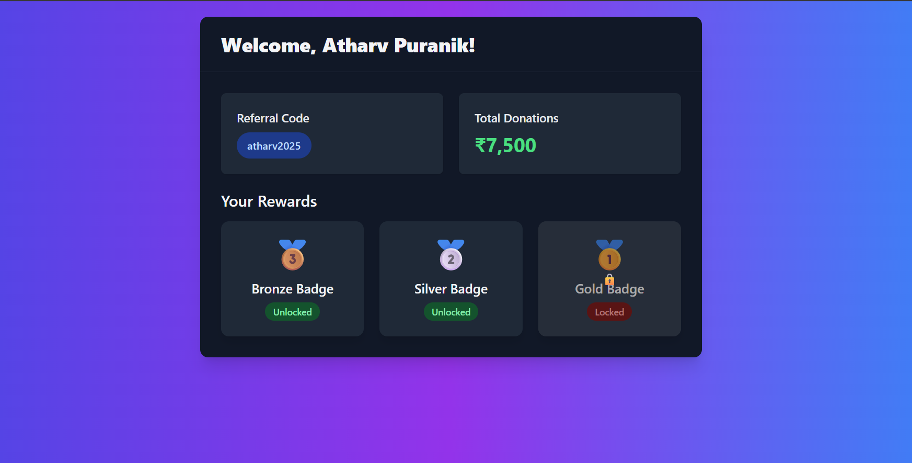
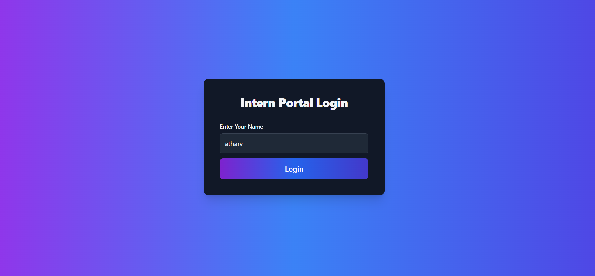

1) Intern Dashboard

This project is a full stack Intern Dashboard built using Spring Boot for the backend and HTML, CSS, and JavaScript for the frontend. It displays intern-specific data like name, referral code, donations raised, and rewards in a clean and responsive UI. 

It was developed as a part of an internship assignment to demonstrate backend integration, frontend design, and REST API usage.

2) Features

Login and signup page (UI only)  
Intern dashboard that shows live data  
REST API endpoint returning intern data as JSON  
Static frontend served using HTML, CSS, and JavaScript  
Fully responsive layout  
Optional leaderboard integration (can be added later)

3) Project Structure

The files are kept in a flat structure (no folders) for simplicity:

InternDashboardApplication.java  
DashboardController.java  
application.properties  
index.html  
dashboard.html  
style.css  
script.js  
pom.xml  
README.md  

4) Technologies Used

Frontend: HTML, CSS, JavaScript  
Backend: Java, Spring Boot  
API Format: JSON  
Build Tool: Maven

5) API Endpoint

GET /api/data  
Returns static JSON data with intern details

Example response:

{
  "name": "Atharv Puranik",
  "referralCode": "ATH12345",
  "donations": 12000,
  "rewards": 3
}

6) How to Run

Make sure you have Java and Maven installed.

To run the backend:

Open terminal or PowerShell  
Navigate to the project folder  
Run the following command

mvn spring-boot:run

To view the frontend:

Simply open index.html or dashboard.html in any web browser  
Or use a static file server to host them locally

7) Future Improvements

Backend authentication for login/signup  
Dynamic leaderboard with ranks  
Database integration with MySQL or PostgreSQL  
Reward claim functionality with transaction history  

7) Author

Atharv Puranik  
GitHub: https://github.com/Atharv28ye  
LinkedIn: https://linkedin.com/in/atharvpuranik

This project is free to use for learning or demonstration purposes.
